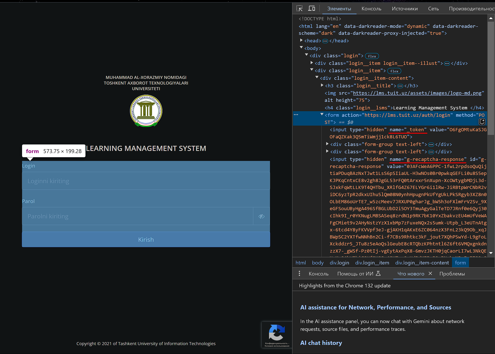

# TUIT.LMS.Resolver
Library used to get data from [lms.tuit.uz](https://lms.tuit.uz). Currently implemented only student related functions

## Token / Captcha
To get token & captcha go to [lms.tuit.uz/auth/login](https://lms.tuit.uz/auth/login)

